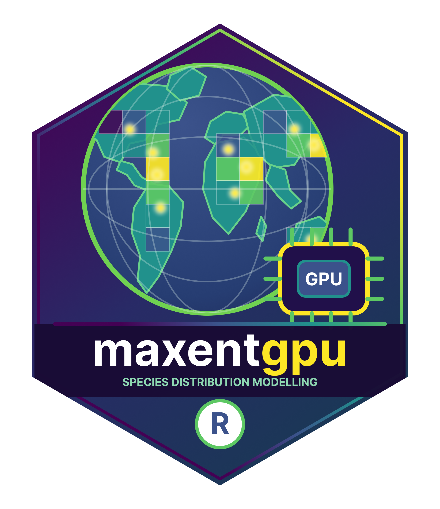

<!-- README.md is generated from README.Rmd. Please edit that file. -->

# maxentgpu <a href='https://thisistaimur.github.io/maxentgpu/'></a>

[](https://lifecycle.r-lib.org/articles/stages.html)
[](https://github.com/thisistaimur/maxentgpu/actions/workflows/ci-release.yaml)
[](https://github.com/thisistaimur/maxentgpu/actions/workflows/pkgdown.yaml)
[](https://github.com/thisistaimur/maxentgpu/releases)

`maxentgpu` is an R package for auditable maximum-entropy presence-background
models implemented with Torch operations. It provides backend diagnostics today,
with model fitting and prediction capabilities under active development.

## Installation

`maxentgpu` is not yet available on CRAN. Install the development version from
GitHub with:

``` r
install.packages("remotes")
remotes::install_github("thisistaimur/maxentgpu")
```

The package currently requires R (>= 4.3.0) and uses the `torch` package for
backend diagnostics. See the [documentation website](https://thisistaimur.github.io/maxentgpu/)
for the API reference and installation details.

## Examples

The backend diagnostic reports which Torch devices can execute a real tensor smoke test:

```{r, eval = FALSE}
library(maxentgpu)

maxent_device_probe()
maxent_accelerators()
```

Model fitting, batching, raster prediction, and additional accelerator support are
being added incrementally. The current release is intended for development and
evaluation rather than production model fitting.

## Contributing

See the [contributing guide](CONTRIBUTING.md) for setup instructions, fixture
provenance, documentation commands, and testing guidance.

GitHub releases are generated from successful `main` builds. CRAN submission
remains a separate maintainer-reviewed process; see `CRAN-READINESS.md`.
